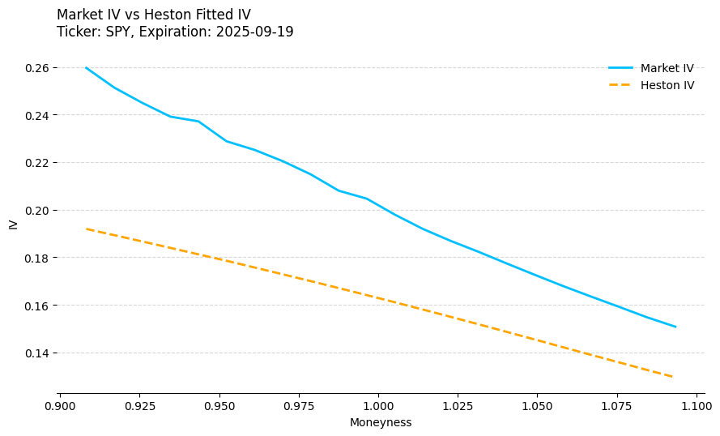

# VolatilitySurface

## Overview

This project analyzes option volatility surfaces and pricing models using both the Black-Scholes and Heston models. The project:

- Collects option chain data for a specified ticker.
- Calibrates the Black-Scholes implied volatility and computes option prices.
- Calibrates the Heston model parameters using parallel processing.
- Generates and compares volatility surfaces for market data, Black-Scholes, and Heston models.
- Computes model performance metrics (RMSE) for the implied volatility outputs.

## Directory Structure
```bat
├───data_fetch.py
├───black_scholes.py
├───heston.py
├───main.py
├───yield_curve.py
├───treasuries
│   ├── billsYYYY-MM-DD.txt
│   └── bondsYYYY-MM-DD.txt
└───plots
    ├── bs_iv_fit.png         # Black-Scholes IV fit plot
    ├── heston_iv_fit.png     # Heston IV fit plot
    ├── market_iv_surface.html  # Market Volatility Surface
    ├── bs_iv_surface.html      # Black-Scholes Volatility Surface
    └── heston_iv_surface.html  # Heston Model Volatility Surface
```


## Requirements

- Python 3.x
- NumPy
- Pandas
- SciPy
- Matplotlib
- Plotly
- Joblib
- yfinance
- pytz
- python-dateutil

Install the dependencies using pip:

```bash
pip install numpy pandas scipy matplotlib plotly joblib yfinance pytz python-dateutil
```

## Data Preparation

Treasury data files are required for constructing the yield curve and estimating the risk-free rate. These files should be placed in the `treasuries` directory and can be obtained from the [WSJ Bonds and Treasuries Data](https://www.wsj.com/market-data/bonds/treasuries).

After acquiring the data, rename the files to include the date of acquisition (e.g., `bills2025-03-16.txt` and `bonds2025-03-16.txt`).

Additionally, the script fetches option chain data for a specified ticker (e.g., SPY) using `yfinance`. The relevant spot price, dividend yield, and historical volatility are then computed to facilitate the subsequent volatility modeling steps.

## Usage

To run the analysis and generate all outputs, execute the main script:

```bash
python main.py
```
The script will perform the following tasks:

1. Fetch and prepare the option chain data for the specified ticker (default: SPY).
2. Compute Black-Scholes implied volatilities and option prices.
3. Calibrate the Heston model parameters using parallel processing.
4. Compute Heston model prices and implied volatilities.
5. Save all relevant plots—including the Black-Scholes IV fit, Heston IV fit, and the market, Black-Scholes, and Heston volatility surfaces—to the `plots` directory.
6. Print a comparison of the Root Mean Squared Error (RMSE) for the implied volatilities produced by both models.

## Results and Findings

### IV Fitness Plots

Two 2D plots were generated to verify that the model-implied volatilities are fitting the market data reasonably well:

- **Black-Scholes IV Fit:**  
  

- **Heston IV Fit:**  



### Volatility Surfaces

- **Market Implied Volatility Surface:**  
  
  [Interactive Market IV Surface](plots/market_iv_surface.html)

- **Black-Scholes Implied Volatility Surface:**  
  
  [View Interactive Black-Scholes IV Surface](plots/bs_iv_surface.html)

- **Heston Model Implied Volatility Surface:**  
  
  [Interactive Heston IV Surface](plots/heston_iv_surface.html)

### RMSE Comparison

The following table summarizes the Root Mean Squared Error (RMSE) for the implied volatilities produced by each model:

| Model         | RMSE    |
| ------------- | ------- |
| Black-Scholes | 0.071541 |
| Heston        | 0.069659 |

These RMSE values provide a quantitative measure of how closely the model-implied volatilities match the observed market data.

## Attribution

- **Heston Model Implementation:**  
  The Heston pricing implementation is adapted from the discussion on Quant StackExchange:  
  [Heston model option price formula](https://quant.stackexchange.com/questions/18684/heston-model-option-price-formula) by the user Appliqué.

- **Yield Curve Module:**  
  The yield curve module was adapted from code provided by Louis R. Piccotti,  
  Associate Professor of Finance, Spears School of Business, Oklahoma State University.  
  *This version: 02.12.2025*


